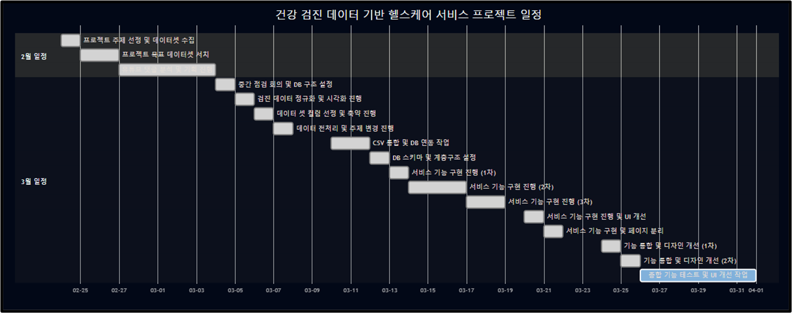
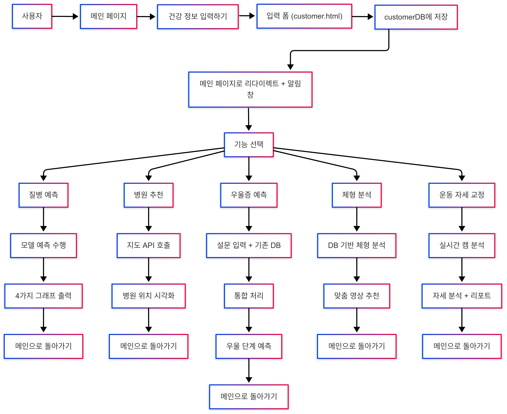

<small> 
  
# ■ 프로젝트명: FinFit

# ■ FinFit - 개인 맞춤형 헬스케어 서비스 

FinFit은 건강 검진 데이터와 AI 예측 모델을 활용하여 사용자의 건강 상태를 정밀 분석하고 맞춤형 솔루션을 제공하는 스마트 헬스케어 서비스를 제공합니다. 또한, 바쁜 현대인을 위해 생활 습관 개선부터 병원 연계까지 체계적인 건강 관리 시스템을 제공하여, 누구나 쉽게 건강을 유지하고 더 나은 미래를 준비할 수 있도록 지원합니다.  

<table>
  <thead>
    <tr>
      <th>항목</th>
      <th>내용</th>
    </tr>
  </thead>
  <tbody>
    <tr>
      <td>개발 기간</td>
      <td>
        2025년 2월 24일(월) ~ 2025년 4월 1일(화)
        &nbsp;&nbsp;&nbsp;&nbsp;&nbsp;&nbsp;&nbsp;&nbsp;&nbsp;&nbsp;&nbsp;&nbsp;&nbsp;&nbsp;&nbsp;&nbsp;&nbsp;&nbsp;&nbsp;&nbsp;&nbsp;&nbsp;&nbsp;&nbsp;&nbsp;&nbsp;&nbsp;&nbsp;&nbsp;&nbsp;&nbsp;&nbsp;&nbsp;&nbsp;&nbsp;&nbsp;&nbsp;&nbsp;&nbsp;&nbsp;&nbsp;&nbsp;&nbsp;&nbsp;&nbsp;&nbsp;&nbsp;&nbsp;&nbsp;&nbsp;&nbsp;
      </td>
    </tr>
    <tr>
      <td>프로젝트 목표</td>
      <td>
        - AI 질병 예측과 그래프로 보는 건강 분석 
        - 질병 별 위치기반 병원 매칭 서비스 
        - 체형 분석을 통한 건강 맞춤 운동 솔루션 제공 
        - 검진 데이터 기반 우울증 예측 및 맞춤 정보 제공 
        - AI 분석을 통한 정확한 운동 자세 교정 서비스
        &nbsp;&nbsp;&nbsp;&nbsp;&nbsp;&nbsp;&nbsp;&nbsp;&nbsp;&nbsp;&nbsp;&nbsp;&nbsp;&nbsp;&nbsp;&nbsp;&nbsp;&nbsp;&nbsp;&nbsp;&nbsp;&nbsp;&nbsp;&nbsp;&nbsp;&nbsp;&nbsp;&nbsp;&nbsp;&nbsp;&nbsp;&nbsp;&nbsp;&nbsp;&nbsp;&nbsp;&nbsp;&nbsp;&nbsp;&nbsp;&nbsp;&nbsp;&nbsp;&nbsp;&nbsp;&nbsp;&nbsp;&nbsp;&nbsp;&nbsp;&nbsp;&nbsp;&nbsp;&nbsp;&nbsp;&nbsp;&nbsp;&nbsp;&nbsp;&nbsp;&nbsp;&nbsp;&nbsp;&nbsp;&nbsp;
      </td>
    </tr>
  </tbody>
</table>

## ■ 목차 
1. 소개  
2. 기능별 요약  
3. 프로젝트 진행 관리  
4. Stacks  
5. 기능 구현  
6. 데이터 & 사용자 흐름도  
7. Architecture  
8. How to Test

<h2> ■ 소개 </h2>

<table style="width: 100%; table-layout: fixed; border-spacing: 0; text-align: center;">
  <tr>
    <td style="width: 20%; padding: 10px; vertical-align: middle;">
      

          
        <strong>이한세 (Michael)</strong> 
        <em style="color:#f0a500;"># Squat Analysis</em>
      

    </td>
    <td style="width: 20%; padding: 10px; vertical-align: middle;">
      

          
        <strong>김미경 (Mia)</strong> 
        <em style="color:#f0a500;"># Body & Workout</em>
      

    </td>
    <td style="width: 20%; padding: 10px; vertical-align: middle;">
      

          
        <strong>이준혁 (Simon)</strong> 
        <em style="color:#f0a500;"># Disease Risk</em>
      

    </td>
    <td style="width: 20%; padding: 10px; vertical-align: middle;">
      

          
        <strong>하연우 (Woo)</strong> 
        <em style="color:#f0a500;"># Mental Health </em>
      

    </td>
    <td style="width: 20%; padding: 10px; vertical-align: middle;">
      

          
        <strong>이기성 (Bradley)</strong> 
        <em style="color:#f0a500;"># Hospital Match</em>
      

    </td>
  </tr>
</table>

## ■ 기능별 상세 요약 

| 기능 | 설명 |
|------|------|
|스쿼트 자세 교정 | 사용자의 스쿼트 자세를 **OpenCV와 MediaPipe**를 이용해 실시간으로 추적하고, **양쪽 무릎 관절 각도**를 기반으로 반복 횟수와 정확도를 분석합니다. 분석된 자세 정보는 **Gemini 기반 AI 피드백 시스템**을 통해 교정 코멘트와 리포트 이미지로 시각화되며, **자세 개선 여부 추적 기능**도 포함되어 있습니다. |
|체형 예측 및 운동 추천 | 사용자의 성별, 연령, BMI 정보를 기반으로 랜덤 포레스트 모델로 체형을 예측하고, 그에 맞는 운동 난이도별 추천 영상을 제공합니다. 예측된 체형에 따라 운동 효과와 난이도를 필터링해 맞춤형 콘텐츠를 제안하며, 도넛 차트 애니메이션과 체형 아이콘 등 시각 요소를 통해 결과를 직관적으로 시각화합니다. |
|질병 예측 | 건강검진 데이터를 기반으로 **당뇨, 고혈압, 고지혈증 등의 유병 확률을 RandomForest 모델로 예측**하고, 위험도는 **막대 그래프 + 툴팁**으로 시각화됩니다. 추가로 **암 위험도 분석**, **2D 레이더 차트 및 3D 정육면체 시각화**를 통해 사용자의 **전반적인 건강 상태를 종합적으로 분석**합니다. |
|우울증 예측 | PHQ-9 설문, 수면 시간, 건강검진 데이터를 기반으로 **우울증 단계를 AI 모델이 예측(없음~심각)**하고, 결과는 **수면 연관 차트**로 시각화됩니다. **Gemini 기반 챗봇이 심리 분석 코멘트**를 자동 생성하며, **SHAP 분석**을 통해 예측에 영향을 준 **주요 요인 설명 기능**도 제공합니다. |
|병원 추천 | 사용자 건강검진 데이터를 기반으로 **질병 유무(당뇨, 고지혈증, 고혈압)를 예측**하고, 위험이 감지되면 **사용자 지역(city, town) 내 '내과' 병원 5곳을 자동 추천**합니다. 추천 정보에는 **병원명, 주소, 전화번호, 위도·경도**가 포함되며, **CSV 기반 병원 정보 + 시각적 위치 연동(Naver 지도 API)** 기능도 함께 구성되어 있습니다. |

## ■  프로젝트 진행 관리 

  

## ■ Stacks 

### Language

### Backend(server)

### Frontend

### Data Science / ML

 

 

### API & External Services

### Dev Tools

## ■ 기능 구현 

### 1. 질병 예측 페이지
- 건강검진 데이터 기반 질병 확률 예측
- 2D/3D 시각화 + 암 리스크 분석 포함

---

### 2. 병원 추천 시스템
- 지역 기반 병원 자동 매칭
- 조건 만족 시 내과 병원 5곳 추천

---

### 3. 우울증 예측 
- 건강정보 기반 정신건강 분석
- PHQ-9 설문과 수면시간, 건강 데이터 기반으로 우울증 단계 예측

---

### 4. 체형 예측 및 운동 추천
- 체형 예측 (RandomForest 기반)
- 운동 목적/난이도별 추천 영상 필터링

---

### 5. 스쿼트 분석 페이지
- Mediapipe 기반 실시간 자세 추적
- 무릎 각도 측정 및 반복 수 카운트

## ■ Service Flow Diagram

## ■ Architecture
<pre>
📂FINFIT/ 
├── 📂models/                   # 학습된 머신러닝 모델 파일 (.pkl)
├── 📂static/                   # 정적 파일 (CSS, JS, 이미지, CSV 등)
├── 📂templates/                # HTML 템플릿 (Jinja2)
├── 📂views/                    # 주요 기능별 Flask 뷰 파일
│   ├── chatbot_views.py          # ✨ (옵션) Gemini 기반 챗봇 응답 처리
│   ├── company_views.py          # 소개/회사 관련 페이지
│   ├── customer_views.py         # 사용자 정보 입력/관리
│   ├── depression_views.py       # 우울증 예측 기능
│   ├── disease_views.py          # 질병 예측 기능
│   ├── exercise_views.py         # 체형 예측 및 운동 추천
│   ├── hospital_views.py         # 병원 추천 기능
│   ├── main_views.py             # 메인 페이지, 라우팅 허브
│   └── squat_views.py            # 실시간 운동 자세 분석 (스쿼트)
├──📂 __init__.py               # Flask 앱 초기화
</pre>

## ■ How to Test 

> 아래 테스트는 Flask 서버 실행 후 http://localhost:5000 접속 시 확인할 수 있습니다.

| 테스트 항목 | 경로 | 주요 확인 내용 |
|-------------|------|----------------|
| 메인 페이지 | / | 전체 기능 링크 및 UI 연결 확인 |
| 사용자 정보 입력 | /customer | 성별·나이·키·몸무게·도시·지역 입력 후 DB 저장 |
| 스쿼트 분석 | /squat | 웹캠 기반 실시간 자세 추적 + 반복 수·피드백 확인 |
| 체형 예측 & 운동 추천 | /exercise | BMI 기반 체형 분류 + 난이도별 운동 영상 추천 |
| 질병 예측 | /disease | 당뇨·고혈압·고지혈증 예측 그래프 + 암 위험도 시각화 |
| 우울증 예측 | /depression | PHQ-9 기반 우울 단계 분석 + 수면 차트, AI 코멘트 확인 |
| 병원 추천 | /hospital | 지역 내 질병별 내과 병원 자동 추천 (Naver 지도 연동) |

🧩 모든 테스트는 가상환경(venv)에서 Flask 실행 후, 브라우저 기반으로 진행합니다.

</small>
